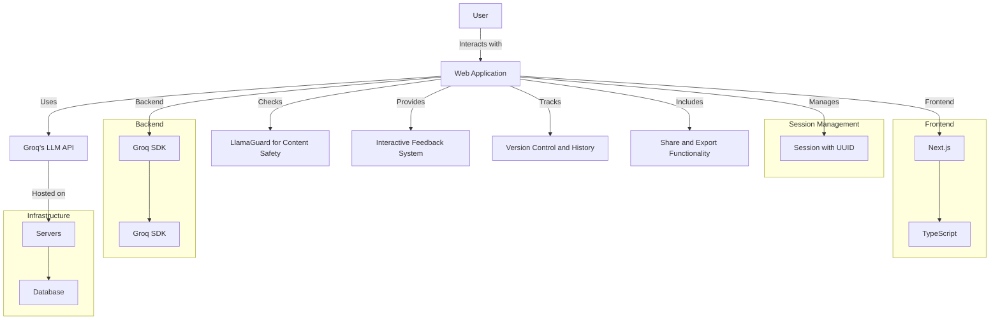
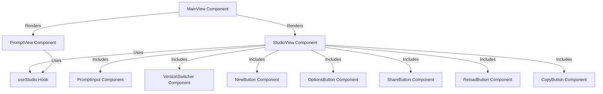
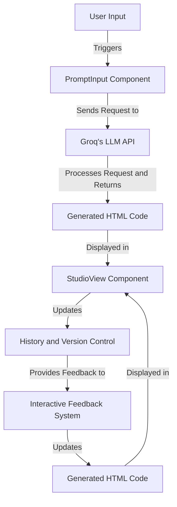

# Groq App Generator

An interactive web application that generates and modifies web applications using Groq's LLM API. Built with Next.js and TypeScript.

## Features

- Real-time app generation based on natural language queries
- Content safety checking using LlamaGuard
- Interactive feedback system for iterative improvements
- Version control and history tracking
- Share and export functionality

## Tech Stack

- Next.js 14 (App Router)
- TypeScript
- Groq SDK
- React Syntax Highlighter
- UUID for session management

## Environment Variables

Required environment variables:
- `GROQ_API_KEY`: Your Groq API key

## Getting Started

1. Clone the repository
2. Install dependencies: `npm install`
3. Set up your environment variables
4. Run the development server: `npm run dev`

The application will be available at `http://localhost:3000`.

## How It Works

The `groq-appgen` repository is an interactive web application that generates and modifies web applications using Groq's LLM (Large Language Model) API. The application is built with Next.js and TypeScript, and it includes several key features such as real-time app generation, content safety checking, an interactive feedback system, version control, and share/export functionality.

### Key Components:
1. **Next.js (App Router):**
   - Handles routing and server-side rendering.
2. **TypeScript:**
   - Provides type safety and enhances code quality.
3. **Groq SDK:**
   - Interacts with Groq's LLM API for generating and modifying web applications.
4. **React Syntax Highlighter:**
   - Used for syntax highlighting in the code editor.
5. **UUID for Session Management:**
   - Manages user sessions uniquely.

## Architecture Diagrams

### Overall Architecture:

### Component Interaction:

### Data Flow:

You can explore more details and view additional files in the [repository](https://github.com/andiekobbietks/groq-appgen).

If you need further details or additional diagrams, please let me know!
